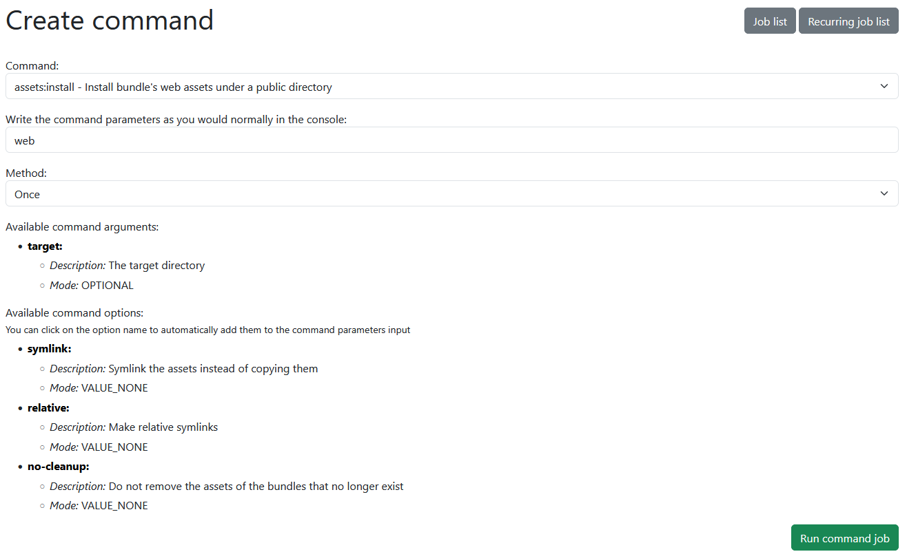

# JobQueueBundle

### Symfony Bundle which aims to replace JMSJobQueueBundle console commands scheduling, using Symfony messenger.

#### Dependencies:

* php: >=8.1
* doctrine/doctrine-bundle: ^2
* doctrine/orm: ^2|^3
* symfony/framework-bundle: ^6.4
* symfony/messenger: ^6.4
* symfony/process: ^6.4
* symfony/translation: ^6.4
* twig/twig: ^3

## Installation:

```
composer require tomatom/jobqueuebundle
```

## Configuration:

#### config/bundles.php:

```php
TomAtom\JobQueueBundle\JobQueueBundle::class => ['all' => true]
```

#### config/routes.yaml:

```yaml
job_queue:
  resource:
    path: '../vendor/tomatom/jobqueuebundle/src/Controller'
    namespace: TomAtom\JobQueueBundle\Controller
  type: attribute
```

#### config/packages/messenger.yaml:

You can create own transport for the job messages - or just use *async* transport

```yaml
framework:
  messenger:
    # Your messenger config
    transports:
    # Your other transports
    job_message:
      dsn: "%env(MESSENGER_TRANSPORT_DSN)%"
      options:
        queue_name: job_message
    routing:
      'TomAtom\JobQueueBundle\Message\JobMessage': job_message # or async
```

#### Update your database so the __'job_queue'__ table is created

```shell
php bin/console d:s:u --complete --force
```

or via migrations if you are using them.

## Usage:

#### Manually creating the jobs in your application:


The function __createCommandJob__ from __CommandJobFactory__ accepts:

* command name,
* command parameters,
* ID of related entity (optional)
* Name of related entity class - self::class (optional)

and returns ID of the created job, for example:

```php
$commandName = 'app:your:command';

$params = [
    '--param1=' . $request->get('param1'),
    '--param2=' . $request->get('param2'),
];

// Try to create the command job
try {
    $job = $this->commandJobFactory->createCommandJob($commandName, $params, $entity->getId(), Entity::class);
} catch (OptimisticLockException|ORMException|CommandJobException $e) {
    // Redirect back upon failure
    $this->logger->error('createCommandJob error: ' . $e->getMessage());
    return $this->redirectToRoute('your_route');
}

// Redirect to the command job detail
return $this->redirectToRoute('job_queue_detail', ['id' => $job->getId()]);
```

#### Creating jobs via the browser interface:
On the url __/command__ you can schedule all commands from your application (Symfony ones included):



On the url __/job/list__ you can see all your jobs


On the url __/job/{id}__ you can see the detail of each job


Note - the design will probably change for the better, but you can create your own. 

Extending the templates can be done like this:

```twig
{# templates/job/detail.html.twig #}



...

...

...
```

To change or add translations for a new locale, use those translation variables in your
translations/messages.{locale}.yaml:

(Currently there are only translations for *en* and *cs* locales)

```yaml
job:
  job_list: "Job list"
  create_job: "Create job"
  detail:
    self: "Detail"
    title: "Planned job"
    refresh: "Refresh"
    runtime: "Runtime"
    closed: "Closed"
    output: "Output"
  list:
    title: "Planned jobs"
    related_entity: "Entity ID"
    back_to_list: "Back to jobs"
  header:
    for_entity_with_id: "for entity with ID"
    for: "for"
  command: "Command"
  state: "State"
  created: "Created"
  runtime:
    hours: "hours"
    minutes: "minutes"
    seconds: "seconds"
  already_exists: "The same job is already planned."
  creation:
    success: "Job successfully planned."
    error: "An error occurred while planning the job"

command:
  title: "Command schedule"
  select: "Select a command to run"
  select.label: "Command"
  schedule.job: "Schedule command job"
  params.label: "Write the command's parameters as you would normally in the console"
  available: "Available command"
  argument: "Argument"
  arguments: "arguments"
  option: "Option"
  options: "options"
  description: "Description"
  mode: "Mode"
  shortcut: "Shortcut"
```

## TODO:
Add configuration for things such as table name

## Contributing:
Feel free to open any issues or pull requests if you find something wrong or missing what you'd like the bundle to have!