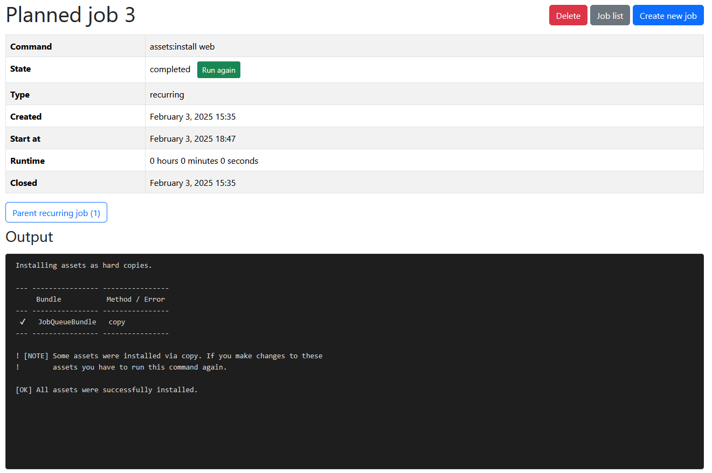

# JobQueueBundle

### Symfony bundle which aims to replace JMSJobQueueBundle for scheduling console commands, with complete browser interface.

## Table of Contents

1. [Features](#features)
2. [Installation](#installation)
3. [Configuration](#configuration)
    - [Bundles](#configbundlesphp)
    - [Routes](#configroutesyaml)
    - [Messenger](#configpackagesmessengeryaml)
    - [Security](#configpackagessecurityyaml)
    - [Job Queue](#configpackagesjob_queueyaml)
4. [Usage](#usage)
    - [Job Types](#types-of-ways-jobs-can-be-run)
    - [Creating Jobs Programmatically](#manually-creating-the-jobs-in-your-application)
    - [Creating Jobs via Browser](#creating-jobs-via-the-browser-interface)
5. [Testing](#testing)
6. [Dependencies](#dependencies)
7. [TODO](#todo)
8. [Additional info / Contributing](#additional-info--contributing)

## Features

- Schedule any command from your app as a server-side job, either programmatically or through a browser interface.
- Run jobs right away, postpone them or make them recurring.
- Browse jobs and see their details in browser.
- Cancel and retry jobs.
- Add related entity and parent job.
- Capture and store specific output from commands in the job's output parameters.

## Installation

```
composer require tomatom/jobqueuebundle
```

## Configuration

#### config/bundles.php:

```php
TomAtom\JobQueueBundle\JobQueueBundle::class => ['all' => true]
```

<hr>

#### config/routes.yaml:

```yaml
job_queue:
  resource: "@JobQueueBundle/src/Controller/"
  type: attribute
```

<hr>

#### config/packages/messenger.yaml:

You can create your own transport for the job messages - or just use *async* transport

```yaml
framework:
  messenger:
    # Your messenger config
    transports:
    # Your other transports
    job_message:
      dsn: "%env(MESSENGER_TRANSPORT_DSN)%"
      options:
        queue_name: job_message
    routing:
      TomAtom\JobQueueBundle\Message\JobMessage: job_message # or async
```

<hr>

#### config/packages/security.yaml:

The bundle uses the role security system to control access for the jobs/command scheduling. You can assign roles based
on the
level of access you want to grant to each user.

Available roles are:

**ROLE_JQB_ALL** - The main role with full permissions. Provides unrestricted access to all features of
the bundle.

**ROLE_JQB_JOBS** - Grants full permissions for jobs (JOB_ roles).

**ROLE_JQB_COMMANDS** - Grants full permissions for command scheduling (COMMAND_ roles).

**ROLE_JQB_JOB_LIST** - Allows access to view the job list.

**ROLE_JQB_JOB_READ** - Allows access to view job details.

**ROLE_JQB_JOB_CREATE** - Allows creating new jobs.

**ROLE_JQB_JOB_DELETE** - Allows deleting jobs.

**ROLE_JQB_JOB_CANCEL** - Allows canceling jobs.

**ROLE_JQB_COMMAND_SCHEDULE** - Allows scheduling commands.

(Also with constants in [JobQueuePermissions.php](src/Security/JobQueuePermissions.php))

To grant full access to users, add **ROLE_JQB_ALL** to the role hierarchy:

```yaml
security:
  role_hierarchy:
    ROLE_ADMIN:
      - ROLE_JQB_ALL
```

To restrict access for example to only viewing the job list and job details (without creation or scheduling), configure
the roles like this:

```yaml
security:
  role_hierarchy:
    ROLE_USER:
      - ROLE_JQB_JOB_LIST
      - ROLE_JQB_JOB_READ
```

#### Note - jobs creation is always possible where security has no loaded user, for example if created in a command.

<hr>

#### config/packages/job_queue.yaml:

You do not have to create this file for the bundle to work, but you can edit some parameters

```yaml
job_queue:
  database:
    job_table_name: "your_job_table_name" # Default = job_queue
    job_recurring_table_name: "your_job_recurring_table_name" # Default = job_recurring_queue
  scheduling:
    heartbeat_interval: "1 hour" # Default = 1 minute
```

#### Update your database so the job tables are created

```shell
php bin/console d:s:u --force
```

or via migrations.

#### Do not forget to run the messenger

This is up to you and where your project runs, but you need to have the messenger consuming the right transport for the
bundle to work.

```shell
php bin/console messenger:consume job_message
```

For recurring messages you also need the scheduler running so the jobs are created

```shell
php bin/console messenger:consume scheduler_job_recurring
```

## Usage

#### Types of ways jobs can be run

- **Once** - Runs once right after creation (Job entity)
- **Once postponed** - Runs once on given time (Job entity)
- **Recurring**
    - Runs repeatedly on time by the
      given [Symfony scheduler cron expression](https://symfony.com/doc/current/scheduler.html#cron-expression-triggers)
      (JobRecurring entity which
      creates new Job entity on every run)
    - Changes in the recurring jobs (adding/deleting/editing) are handled by the "heartbeat" message, which runs on the
      given interval (default is 1 minute but can be edited in the config file - if you do not add / edit them often,
      you can set it to higher value)

Once job is created, [Symfony messenger](https://symfony.com/doc/current/messenger.html) message is created which
handles the run of the command from the job.

### Manually creating the jobs in your application:

The function __createCommandJob__ from __CommandJobFactory__ accepts:

* command name
* command parameters
* ID of related entity (optional)
* name of related entity class - (optional)
* job entity for parent job (optional)
* entity of recurring parent job (optional)
* datetime of postponed job start (optional)

and returns the created job.

**Basic example**:

```php
$commandName = 'app:your:command';

$params = [
    '--param1=' . $request->get('param1'),
    '--param2=' . $request->get('param2'),
];

// Try to create the command job
try {
    $job = $this->commandJobFactory->createCommandJob($commandName, $params);
} catch (OptimisticLockException|ORMException|CommandJobException $e) {
    // Redirect back upon failure
    $this->logger->error('createCommandJob error: ' . $e->getMessage());
    return $this->redirectToRoute('your_route');
}

// Redirect to the command job detail
return $this->redirectToRoute('job_queue_detail', ['id' => $job->getId()]);
```

**Adding a related entity**:

Purpose of this is to filter jobs seen in the list by the related entity.

For example, if you have a Customer entity:

```php
$job = $this->commandJobFactory->createCommandJob($commandName, $params, $customer->getId(), Customer::class);
```

If you then go to the job list with parameters /job/list/**Customer**/**1** (which is being automatically
added if going from the detail with related entity) or if you add it to the list path yourself like:

```twig
<a href="{{ path('job_queue_list', {'name': constant('class', customer), 'id': customer.id}) }}">{{ 'job.job_list'|trans }}</a>
```

then the job list only contains jobs for that given customer.

You can also only add the entity name to get all jobs for a given entity.

**Adding a parent job**:

Jobs can have another one as a parent job. One job can have multiple children jobs.

This can be used if for example you need to create a job that has to run after another job finishes.

(Recreating jobs also creates a new one with the original as a parent.)

```php
// Retrieve another job entity to add as a parent job
$parentJob = $this->entityManager->getRepository(Job::class)->findOneBy(['command' => $command, 'status' => Job::STATUS_COMPLETED]);
$job = $this->commandJobFactory->createCommandJob($commandName, $params, null, null, $parentJob);
```

If jobs have any children/parent there will be button links to them in the job detail (for parents also in job list).

**Creating a postponed job**:

If you want to set a command to run once in given time - set $startAt of type DateTimeImmutable

```php
$startAt = DateTimeImmutable::createFromFormat('Y-m-d\TH:i', $postponedDateTime);
$job = $commandJobFactory->createCommandJob($commandName, $params, $listId, $listName, null, null, $startAt);
```

**Creating / updating a recurring job**:

```php
$jobRecurring = $this->entityManager->getRepository(JobRecurring::class)->find($id);
if ($jobRecurring) {
    $commandJobFactory->updateRecurringCommandJob($jobRecurring, $commandName, $params, $frequency, $active);
} else {
    $commandJobFactory->createRecurringCommandJob($commandName, $params, $frequency, $active);
}
```

Where both functions call the function __saveRecurringCommandJob__ from __CommandJobFactory__, which accepts:

* job recurring - updated recurring job (only on updateRecurringCommandJob)
* command name
* command params
* frequency
  of type [Symfony scheduler cron expression](https://symfony.com/doc/current/scheduler.html#cron-expression-triggers)
* is active

**Saving values from the command output**:

If you need to retrieve and save any data from the output of a command that is running from a job, you can do that by
adding anything after
constant **Job::COMMAND_OUTPUT_PARAMS** in the command output, for example:

```php
$io->info(Job::COMMAND_OUTPUT_PARAMS . $customerId) // $customerId = 123;
```

This will output in the console **OUTPUT PARAMS: 123** and the '123' will be saved in the job's **outputParams**, which
can be then used for example to retrieve the customer entity.

```php
$customer = $this->entityManager->getRepository(Customer::class)->find($job->getOutputParams());
```

Output params are saved in the database as a TEXT and you can save multiple values, which are then separated by a comma,
for example:

```php
$io->info(Job::COMMAND_OUTPUT_PARAMS . 123);
$io->info(Job::COMMAND_OUTPUT_PARAMS . 'some text value');
$io->info(Job::COMMAND_OUTPUT_PARAMS . implode(['a', 'b']));
```

this will be saved as '123, some text value, ab' and then you need to individually handle getting the values by
what you've
saved.

### Creating jobs via the browser interface:

Available urls:

- **command/schedule** - Create a command to run as job
- **command/schedule/{id}** - Edit recurring job
- **job/list/{name}/{id}** - List jobs (related entity name+id)
- **job/recurring/list** - List recurring jobs
- **job/{id}** - Job detail with command output

| Schedule Command                                                 | Job List                                         | Job Detail                                           |
|------------------------------------------------------------------|--------------------------------------------------|------------------------------------------------------|
|  |  |  |

Job detail gets updated automatically while the job is running.

**All the pages are also responsive for mobile use.**

Extending the templates can be done like this:

```twig
{# templates/job/detail.html.twig #}



...

...

...
```

To change or add translations for a new locale, use translation variables from bundle's translations in your
translations/messages.{locale}.yaml:

(Currently there are only translations for *en* and *cs* locales)

## Testing

The bundle has ready tests for job creations in the tests/ folder.
Running tests in your app can be done like this:

```bash
vendor/bin/phpunit vendor/tomatom/jobqueuebundle/tests/
```

The tests are also run on every push / pull request on GitHub.

## Dependencies

* "php": ">=8.1",
* "doctrine/doctrine-bundle": "^2",
* "doctrine/orm": "^2|^3",
* "dragonmantank/cron-expression": "^3",
* "knplabs/knp-paginator-bundle": "^6",
* "spiriitlabs/form-filter-bundle": "^11",
* "symfony/form": "6.4 || ^7.2",
* "symfony/framework-bundle": "6.4 || ^7.2",
* "symfony/lock": "6.4 || ^7.2",
* "symfony/messenger": "6.4 || ^7.2",
* "symfony/process": "6.4 || ^7.2",
* "symfony/scheduler": "6.4 || ^7.2",
* "symfony/security-bundle": "6.4 || ^7.2",
* "symfony/translation": "6.4 || ^7.2",
* "twig/twig": "^2|^3"

## TODO

[Handle getting changes of recurring jobs in better way](/../../issues/3)

## Additional info / Contributing

Special thanks to [schmittjoh](https://github.com/schmittjoh) for the
original [JMSJobQueueBundle](https://github.com/schmittjoh/JMSJobQueueBundle).

This bundle **is not a fork, nor is building on top of the original bundle**, it's our own take on the console
command scheduling, so please bear that in mind when using it. However, going from the original to this bundle should be
seamless.

Feel free to open any issues or pull requests if you find something wrong or missing what you'd like the bundle to have!
